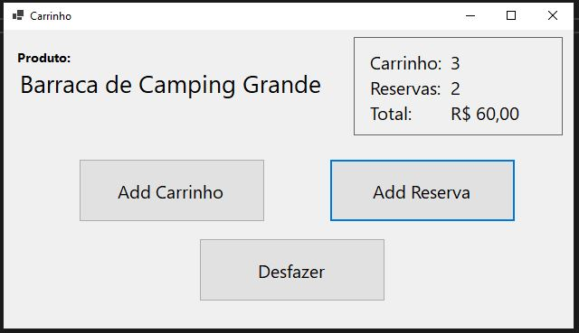

# ShoppingCartCommandPatternWF
Um simples projeto criado em Windows Form com C# e .Net 7 utilizando a implementação do <b>Command Design Pattern.</b>

## Objetivo
Este projeto tem por objetivo testar, entender e realizar alguns dos meus estudos em design pattern utilizando o livro <b>Design Pattern</b> do <b>GOF</b>. 

## Descrição
Neste projeto temos uma simples simulação de um carrinho de compras com os botões <b>Add Carrinho</b> do qual adiciona 1 quantidade ao carrinho, Add Reserva</b> do qual adiciona 1 quantidade para reserva e o botão <b>Desfazer</b> do qual desfaz cada ação realizada dando o mesmo efeito do "desfazer" no windows. Este efeito se dá por conta da utilização do recurso de "pilha" ao qual são armazenados e listados os comandos efetuados.

<table border="0" align="center">
    <tr>
        <td>
            
        </td>
    </tr>
</table>

## Command Pattern
O padrão Command é um padrão de design comportamental que encapsula uma solicitação como um objeto, permitindo parametrizar clientes com operações, enfileirar solicitações, registrar solicitações e oferecer suporte a operações desfazer.

Durante várias semanas estive com meus colegas [Charles Path](https://www.linkedin.com/in/cpath/) e [Michel Guedes]( https://www.linkedin.com/in/michel-guedes-87793051/) onde fizemos várias calls analisando, discutindo, testando e lendo sobre este e vários outros patterns e demais assuntos sobre tecnologia.

